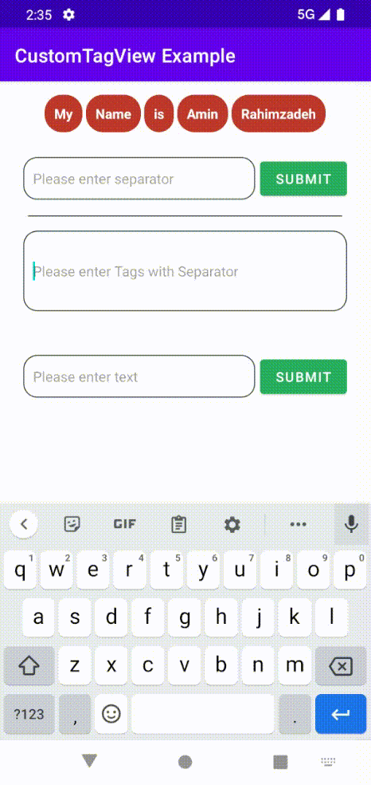

# CustomTagView



## Example TextView

You can set customView to tags with inflater

```xml
<amin.rz3.customtagview.TextCustomTagView
        android:id="@+id/textCustomTagView"
        android:layout_width="match_parent"
        android:layout_height="wrap_content"
        android:text="My Name is Amin Rahimzadeh"/>

<amin.rz3.customtagview.EditTextCustomTagView
        android:id="@+id/etCustomTagView"
        android:layout_width="match_parent"
        android:layout_height="wrap_content"
        android:hint="Please enter Tags with Separator"
        />
```

You can set the separator according to your text
text = My name is Amin Rahimzadeh ------> Separator is space
```kotlin
    val textCustomTagView = findViewById<TextCustomTagView>(R.id.textCustomTagView)
	textCustomTagView.setCustomTagViewBuilder(object : CustomTagViewBuilder(){
        override fun getTagView(inflater: LayoutInflater?, data: String?): View? {
           val view = inflater?.inflate(R.layout.view_custom_text_tag,null)
           val tv = view?.findViewById<TextView>(R.id.tvCustomTextTagRed)
           tv?.text = data
           return view
        }
    })

    textCustomTagView.setSeparator(" ")
    textCustomTagView.createCustomTagView()
```

## Example EditText

```xml
<amin.rz3.customtagview.EditTextCustomTagView
        android:id="@+id/etCustomTagView"
        android:layout_width="match_parent"
        android:layout_height="wrap_content"
        android:hint="Please enter Tags with Separator"
        />
```

```kotlin
    val etCustomTagView = findViewById<EditTextCustomTagView>(R.id.etCustomTagView)
	etCustomTagView.setCustomTagViewBuilder(object : CustomTagViewBuilder(){
       override fun getTagView(inflater: LayoutInflater?, data: String?): View? {
         val view = inflater?.inflate(R.layout.view_custom_text_tag_orange,null)
         val tv = view?.findViewById<TextView>(R.id.tvTagOrange)
         tv?.text = data
         return view
       }
    })
    etCustomTagView.setSeparator(" ")
```

## Example Tag OnClickListener
```kotlin
    textCustomTagView.setCustomTagViewOnClick(object : CustomTagViewOnClick{
       override fun onClick(text: String, startPos: Int, endPost: Int) {
          Toast.makeText(applicationContext, "Clicked $text",Toast.LENGTH_LONG).show()
       }
    })
```

if you need delete tag when click them you can use this:
```kotlin
    textCustomTagView.setCustomTagViewOnClick(object : CustomTagViewOnClick{
       override fun onClick(text: String, startPos: Int, endPost: Int) {
          textCustomTagView.text.replaceRange(startPos,endPost,"")
       }
    })
```

## Installation

CustomTagView is available in jcenter. To install
it, simply add the following line to your app level `build.gradle`:

```groovy
implementation ''
```

if that alone didn't work, add this line to project level `build.gradle`

```groovy
repositories {
    maven {
         url  ""
    }
}
```

[]()
[](https://kotlinlang.org/)
